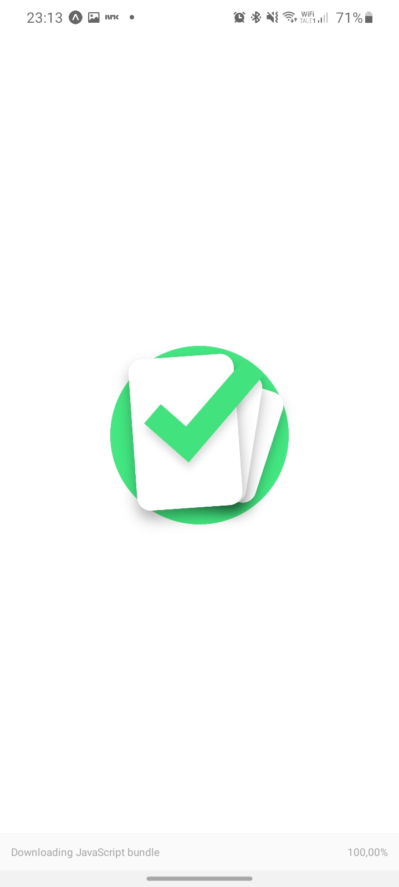
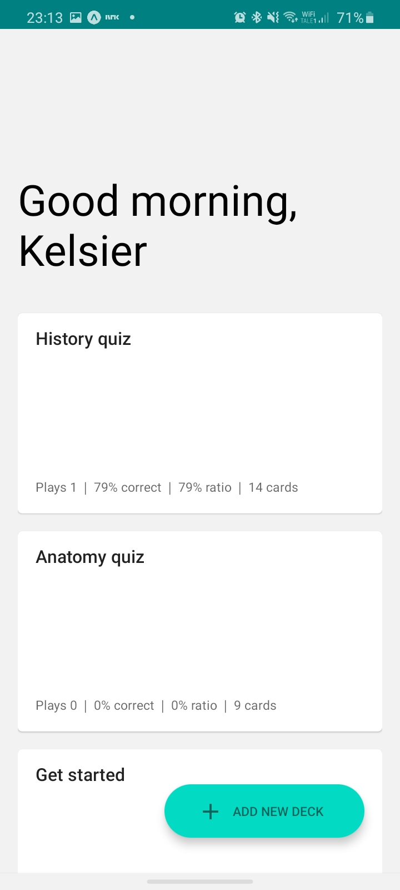
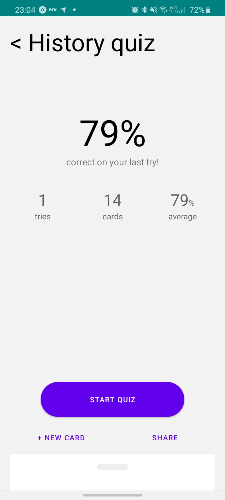
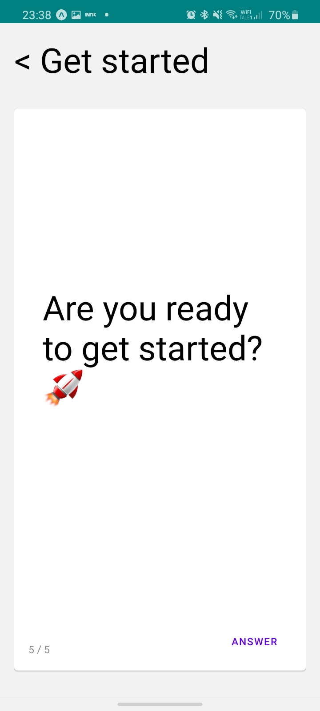

<p align="center">
   
</p>

<h1 align="center">Study Cards</h1>

<p align="center">
      &nbsp&nbsp&nbsp
      &nbsp&nbsp&nbsp
   

   <br>
   <br>

   <i>
      An app to help with studying. Type in the questions and answers you need to memorize and let the app help you learn them in a fun way. Track your progress and beat your high scores!
   </i>
</p>

---

- [📸 Screenshots](#-screenshots)
- [💻 Development environment](#-development-environment)
- [🏅 Credits](#-credits)


## 📸 Screenshots

<p>
   
   
   
   
</p>


## 💻 Development environment

To get the app up and running for development environments you need to have `git`, `nodejs`, `yarn` and `npm` installed.

When you are ready, follow the instructions to start the app:

1. Clone the repository:
   ```sh
   git clone [url]
   ```
   - You can get the url from the top right corner (`Clone or download 🔽`)
2. Navigate into the cloned project:
   ```sh
   cd study-cards
   ```
3. Install the dependencies:
    ```sh
   yarn install
   ```
   - This can take a minute or two depending on your network connection
4. Start the development server:
    ```sh
   yarn start
   ```
   - This can also take a minute or two


## 🏅 Credits

Me, myself and I made this app with pure hard work and a couple sleepless nights – but it was all love ❤

The Expo splash-screen-starting-template also deserves some credits.
